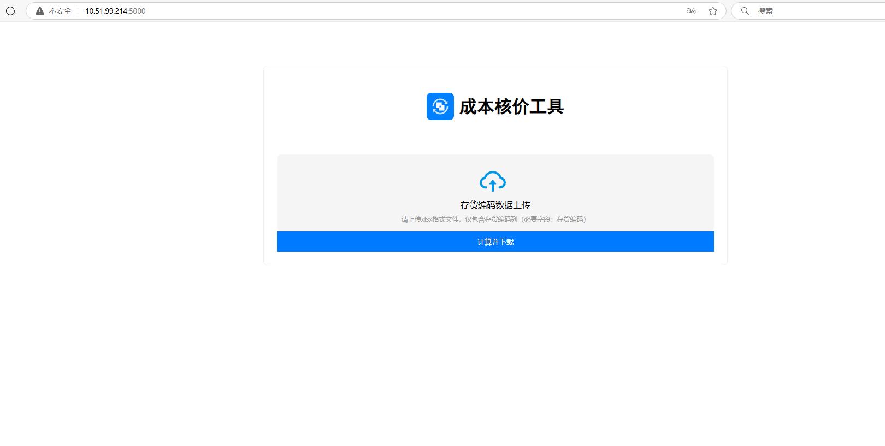
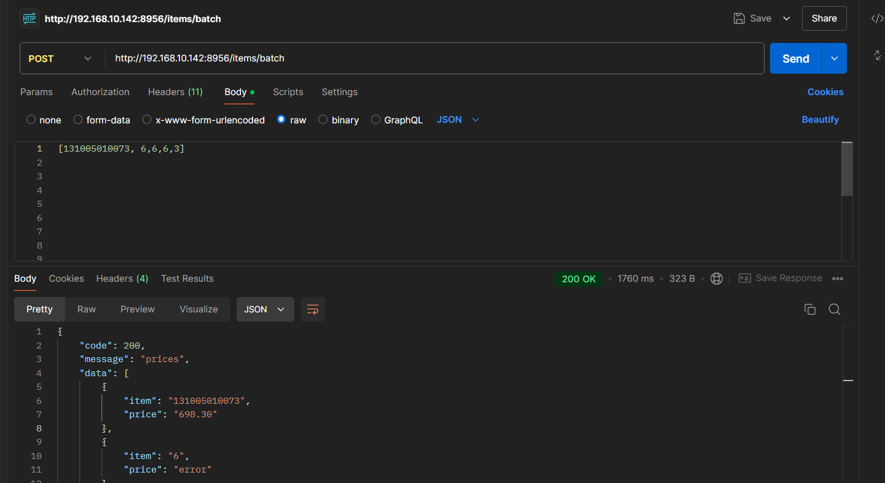

# 成本核算（财务核算 && 报价管理） 💹

## 项目目的 🎯
本项目旨在帮助财务部门核算当月发货材料成本，并协助市场部进行成品报价。

## 页面示例 📸

## 实现方案 🛠️（难点：物料多对多、Bom结构状态、最新采购价格、价格更新规则、大类价格唯一）
- part_01:创建新数据库获取物料最新价格（全Null改为0，单个Null改为上一次非Null值等等）
- part_02:读取数据库为字典，基于用友数据库的Bom一阶展开，递归分解函数展开所有物料，匹配价格计算总成本

### 后端部分 🖥️
- **Bom分解展开** 🧩
- **MySQL新建存货价格对照表** 📊
- **FastAPI提供接口** 🌐

### 前端部分 🖥️
- **Layuimini框架（辅助同事）** 🧑‍💻
- **Dash框架（单独的核价工具）**
- **获取上传表格并计算** 📈

## 技术栈 🛠️
- **数据分析**: Pandas 🐼
- **数据库**: SQL Server, MySQL 
- **前端**: JS, Dash 🌐
- **后端**: FastAPI 🚀

## 特别感谢 🙏
- [ChatGPT代码助手](https://chat.deepseek.com/) 🤖
- [全阶展开初始SQL](https://www.cnblogs.com/klsddnh/p/14787918.html) 📜

