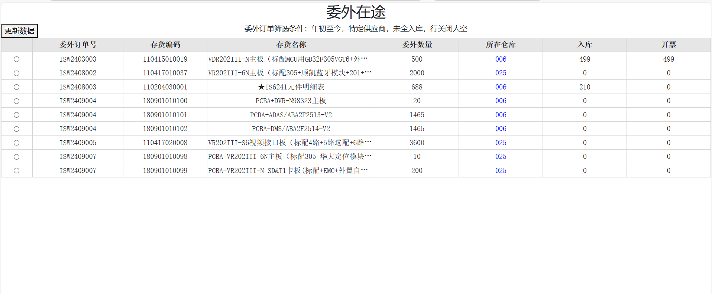
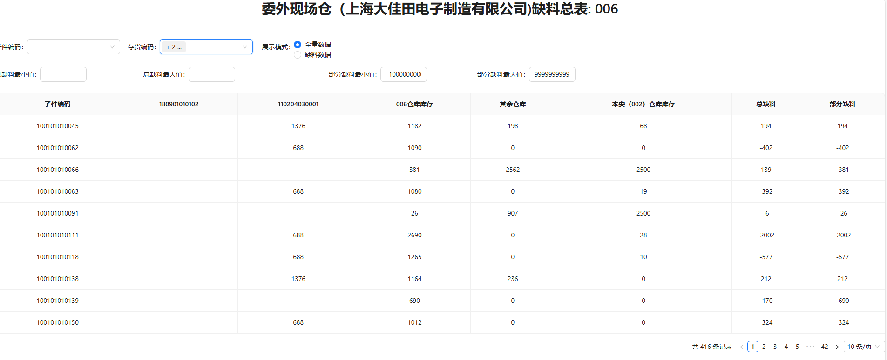
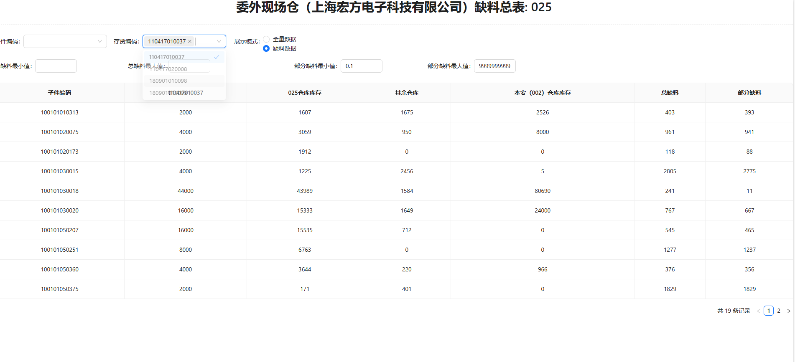

# 🎉 委外在途（齐料贴片） 🎉

## 🌟 项目简介 🌟
本项目目的是管理和追踪委外订单，帮助委外仓库管理人员协调库存和获取委外物料情况

## 🚀 快速开始 🚀

准备好开始了吗？以下是你可以如何开始：（代码涉及数据库暂未上传，仅作演示）

1. **克隆仓库**：`git clone https://github.com/your-repo-url`
2. **安装依赖**：`pip install -r requirements.txt`
3. **运行项目**：`python app.py`

## 📸 页面示例 📸

## 🛠️ 实现方案 🛠️

### 后端部分

- **SQL语句筛选特定条件的委外订单**
- **委外订单存货编码对应子件获取**
- **展示指定、其余仓库对应子件的存量**

### 前端部分

- **主页面委外详情展示**
- **所在仓库的跳转对应各仓库缺料总表**
- **子页面的交互逻辑（部分缺料列随存货编码选择变更）**

## 📚 技术栈 📚

- **数据分析**：pandas
- **数据库**：sqlserve、mysql
- **前后端交互**：dash（交互式仪表盘框架）、feffery_antd_components（网页组件）

## 🌟 特别感谢 🌟

以下排名不分先后：

- [https://chat.deepseek.com/](https://chat.deepseek.com/)（GPT代码助手）
- [https://www.cnblogs.com/feffery/p/](https://www.cnblogs.com/feffery/p/)（demo示例）
- [https://blog.51cto.com/yilesh](https://blog.51cto.com/yilesh)（委外订单子件用料单）
- [https://blog.csdn.net/m0_61834747/article/details/139594966](https://blog.csdn.net/m0_61834747/article/details/139594966)（表单视图名查询）
- [https://blog.csdn.net/qq_44759590/article/details/131850095](https://blog.csdn.net/qq_44759590/article/details/131850095)（常用数据库表名）

